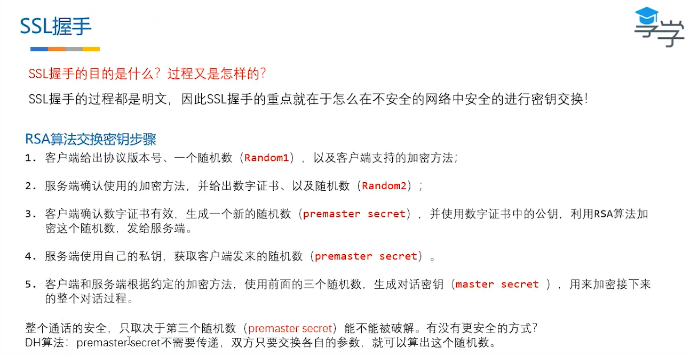
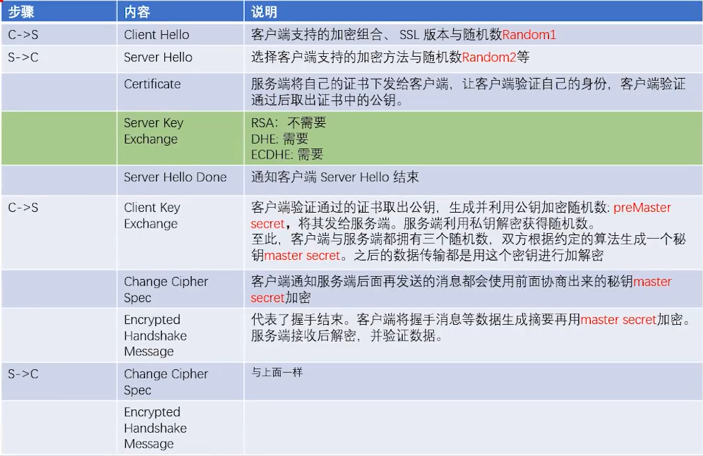

# HTTP

GET请求报文(Content-Length编码方式)

```http
GET /v3/weather/weatherInfo?city=长沙&key=13cb58f5884f9749287abbead9c658f2 HTTP/1.1
Host: restapi.amap.com
```

GET响应报文(Content-Length编码方式)

```http
HTTP/1.1 200 OK
sc: 0.013
Server: Tengine
Access-Control-Allow-Origin: *
Access-Control-Allow-Methods: *
gsid: 011018231092162969815550700012440567641
Connection: close
Content-Length: 445
Date: Mon, 23 Aug 2021 05:55:55 GMT
Access-Control-Allow-Headers: DNT,X-CustomHeader,Keep-Alive,User-Agent,X-Requested-With,If-Modified-Since,Cache-Control,Content-Type,key,x-biz,x-info,platinfo,encr,enginever,gzipped,poiid
Content-Type: application/json;charset=UTF-8
{"status":"1","count":"2","info":"OK","infocode":"10000","lives":[{"province":"湖南","city":"长沙市","adcode":"430100","weather":"多云","temperature":"33","winddirection":"西南","windpower":"4","humidity":"61","reporttime":"2021-08-23 13:32:20"},{"province":"湖南","city":"长沙县","adcode":"430121","weather":"多云","temperature":"33","winddirection":"西南","windpower":"4","humidity":"61","reporttime":"2021-08-23 13:32:21"}]}

```


GET请求报文(Chunk分块编码方式)

```http
GET /v3/weather/weatherInfo HTTP/1.1
Host: restapi.amap.com
```

GET响应报文(Chunk分块编码方式)

```http
HTTP/1.1 200 OK
Transfer-Encoding: chunked
sc: 0.000
Server: Tengine
Access-Control-Allow-Origin: *
Access-Control-Allow-Methods: *
gsid: 011018221254162970029101600012630688040
Connection: close
Vary: Accept-Encoding
Date: Mon, 23 Aug 2021 06:31:31 GMT
Access-Control-Allow-Headers: DNT,X-CustomHeader,Keep-Alive,User-Agent,X-Requested-With,If-Modified-Since,Cache-Control,Content-Type,key,x-biz,x-info,platinfo,encr,enginever,gzipped,poiid
Content-Type: application/json
响应:{"status":"0","info":"INVALID_USER_KEY","infocode":"10001"}

```

[测试代码](http-get/src/main/java/http/HttpRequestBuilder.java)

# HTTPS





[测试代码](http-get/src/main/java/https/HttpsRequestBuilder.java)

